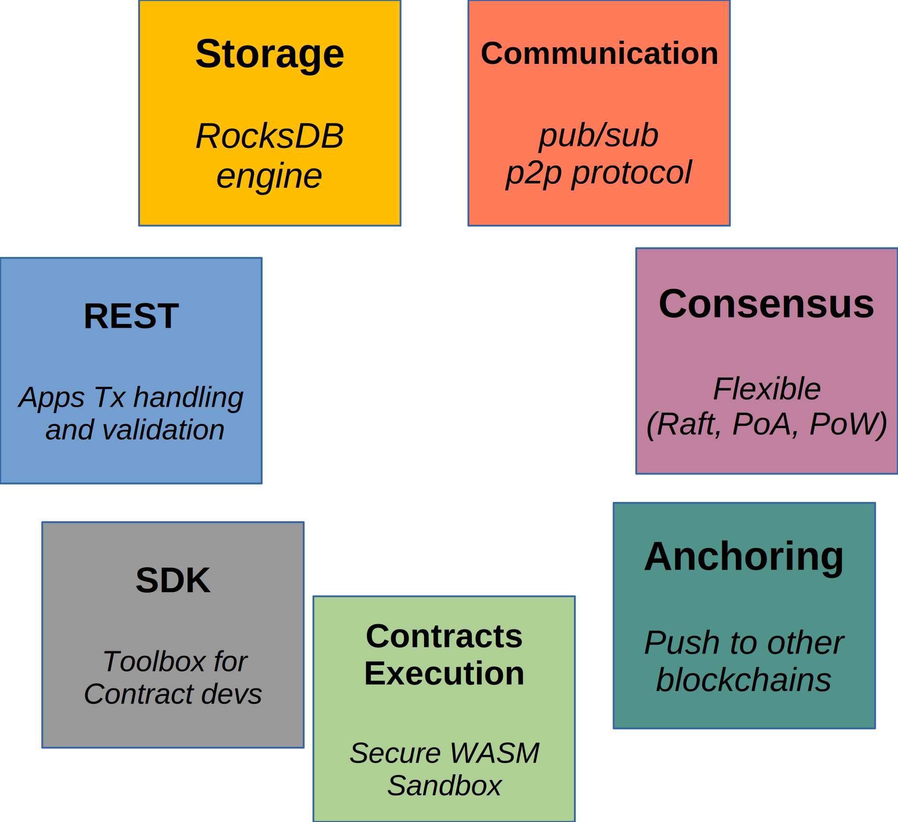
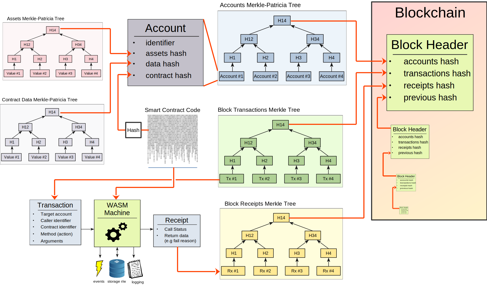

Core Architecture
=================

## Preamble

TRINCI ambition is to provide a flexible yet efficient blockchain **framework**
to construct a node capable to run **any** any application-specific business
logic.

It is an ambitious project because:
- it has been developed from scratch;
- introduces some innovative features not found in any major project;
- provides a flexible consensus mechanism and smart contracts environment.

## Core components

- Storage: persistent blockchain storage using performance oriented key-value
  storage.
- Communication: inter node communication using p2p pub/sub protocol .
- Consensus: flexible and scope-specific (PoA or PoW).
- Anchoring: optional service to perform anchoring on other stable chains.
- Smart Contracts Execution: failure-proof sandbox to execute very specialized
  smart-contracts and capability to implement shared libraries.
- SDK: libraries to allow implementation of smart contracts using the most
  widespread programming languages.
- Flexible communication channels: client side can communication to the
  blockchain using several communication channels (http-rest, raw tcp sockets,
  custom).

## Blocks Structure

A block captures the ledger overall status in a very efficient and compact
manner in order to optimize storage and network traffic.

A block summarizes:
- **Transactions** contained within the block.
- **Receipts** generated by the block's transactions.
- **User Accounts** status after block transactions execution.
- **Previous block** hash.

The structures allows to efficiently generage *proof of presence* for both the
transactions and receipts.

## From Transactions to Blocks

First it is important to clarify that from an application perspective the
blockchain represents a simple key-value storage.

All the complexities and internal machinery are hidden from the user experience.

The only difference between a normal database and the blockchain is that the
execution of smart contracts - triggered by the transactions - are asynchronous.

Thus at transaction-submission time, the user can only know if the transaction
has been accepted by the blockchain for execution (unconfirmed transaction) but
the execution of the actions are postphoned in order to allow the consensus
between all the nodes that are part of the blockchain network.

### Transactions

A transaction express the will of the transaction submitter to perform an action
over an account (commonly but not limited to its account).

To perform its business logic A transaction triggers a call to a specific
**smart contract**, a way to extend blockchain functionalities to construct
application specific business logic.

As already said, transactions actions are executed asynchronously and the
**clearing delay**, i.e. the interval between transaction generation and its
inclusion into a block, depends on the node configuration and used consensus
mechanism.

The blockchain core is agnostic to the specific application business logic and
its actions are limited to transaction format sanity checks, submitter digital
signature verification and propagation into the network.

### Blocks

A block is a sequence of transactions that shall be executed in the same order
by the nodes that are part of the blockchain. A block modifies the key-value
storage.

From the user perspective, a block can be tought as an *atomic patch* that
should be applied to the key-value storage.

Transactions within a block are ordered and verified before being committed into
a block. The ordering is performed by the consensus algorithm.

Transactions that are considered to be valid by the core, but that for some
reasons are rejected by the smart contract, will be part of the block anyway.
Their actions (i.e. modifications to the database) are not committed but a
receipt is generated with the cause of the failure.

### Transaction to Block Lifetime

- Transaction is generated and signed by the user application.
- Transaction is received by the core via one of the exposed blockchain input
  channels (e.g. REST service).
- Transaction is checked for validity: message format, digital signature
  verification and anti-replay protection.
- A feedback is immediatelly returned to the submitter. On success the
  transaction hash. On failure, a message with the failure reason.
- On failure, the transaction journey stops here.
- Transaction is propagated to *all* the network nodes via pub/sub protocol.
- Non confirmed transactions are kept in an *unconfirmed* queue waiting for
  inclusion within a new block.
- A new block is created and proposed for consensus if one of these two
  conditions are met:
  - the transactions per block thresold is reached.
  - a configurable timeout is triggered.
- A block proposal is propagated to the verifiers using pub/sub algorithm to
  reach consensus.
- When the transactions within a block are confirmed the block is inserted
  within the blockchain and the changes are atomically applied.

### Asynchronous Results

Transactions are **asynchronous**, meaning that the transaction submitter is not
given an immediate response as the result of the transaction execution.
Synchronous notification is impossible due to of how consensus works in
blockchains.

Once that a transaction has been successfully submitted, the user owns what is
commonly referred to as the transaction *ticket* (i.e. the transaction hash).

Submitter can fetch execution status using two methods: interrupt or poll based.

- interrupt: core gives the application the ability to subscribe to events of
  interest. In particular, the application can subscribe to events indicating
  new blocks creation. Once that a block creation event has been received, the
  submitter can check if the transaction he was waiting for has been included in
  that block by using the transaction ticket.
- polling: the application polls the core using the transaction ticket asking
  for the receipt. Polling times depends on node configuration, but commonly is
  a matter of seconds.

### Unsuccessful Transactions

Smart contracts execution may fail. Errors format are defined by the smart
contract itself (application specific).

The DB contains both successful and unsuccessful transactions provided that the
validators agree on the same result.

Logging is provided to allow light clients to verify the execution status.

At smart contract level there are two logging categories:
- local logs: forwarded to the node logger.
- emit events: forwarded to the bridge service to be eventually forwarded to
  external components (e.g. user application).
