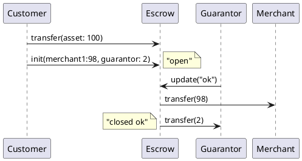
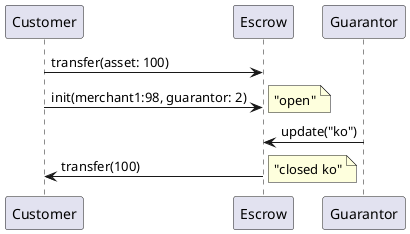

Escrow
===


## Features

 - The `Escrow` smart contract is used to perform a payment trough a third party.

## Escrow account creation

To create an new escrow we use the default contract `transfer` method to send some asset to an account that will be the Escrow.

Then a new `init` Transaction need to be sent to the Escrow Account

## Methods

### `init`

- Can be executed only by the Escrow Account `owner`

```json
args: {
    "asset": account-id,
    "guarantor": account-id,
    "customer": account.id,
    "merchants":{
        "m1_account-id": integer,
        ...
        "mN_account-id": integer,
    }
}
```

### `update`

- Can be executed only by the `guarantor` specified within the "escrow descriptor".
  (NOTE: this can be different from the owner of the escrow account).
- It will be executed only if the Escrow `status` is `PENDING`.
- Transfers the asset from the escrow account to the destination wallet(s).
- If invoked with argument "OK" the asset is transfered from the escrow account to the `merchants` wallets.
- If invoked with argument "KO" the asset is transfered from the escrow account to the `customer` wallet.
- After the execution with success the `status` will be set to `CLOSED_OK` or `CLOSED_KO` (depending on the update argument).

```json
args: {
    "status": string   // possible values  "OK" or "KO"
}
```

### `balance`

- Can be executed only by:
  - the owner
  - the customer
  - the merchants
- Get the balance of the Escrow Account

```json
    args: {
        "asset": account-id     // Asset account id
    }
```

 - Returns:
   ```json
   {
       integer  // this is the amount of the asset specified in the args
   }
   ```


### `get_info`
 - Returns the Escrow information

 ```json
 args: {}
 ```

 - Returns:
   ```json
   {
        "config": {
            "asset": account-id,
            "guarantor": account-id,
            "customer": account.id,
            "merchants":{
                "m1_account-id": integer,
                ...
                "mN_account-id": integer,
            }
        },
        "amount": integer,
        "status": string
   }
   ```

## Escrow Account Data field

```json
    "config":{
        "asset": account-id,
        "guarantor": account-id,
        "customer": account.id,
        "merchants":{
            "m1_account-id": integer,
            ...
            "mN_account-id": integer,
        }
    }
```


## Graphic flow

### Escrow closed successfully

  

  
### Escrow closed with refund
