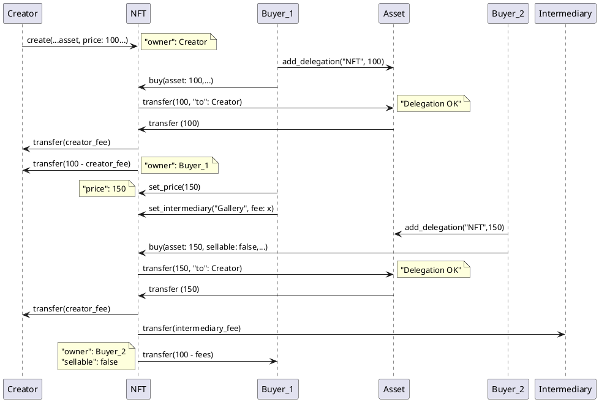

NFT
===

## Features
 - Allows to create and exchange a Non-fungible token

## Methods

### `init`
 - Initialize the NFT
 - Can be invoked only once by the Creator

   ```json
   args: {
   	"creator": account-id,	   	 // NFT original creator (e.g. the artist, if the NFT is an art asset)
   	"owner": account-id, 	   	 // current NFT owner. Initially equal to creator.
   	"identifier": binary, 	   	 // NFT instance unique identifier. For example the sha256.
   	"data": binary,				 // The entire NFT if this is below a certain size,
	   							 // otherwise the field is    an empty array
   	"sellable": bool,		   	 // Specify if the asset can be sold.
   	"asset": account-id, 	   	 // The asset linked to the NFT. Chosen initially by the creator.
	   							 // Cannot be changed.
   	"price": integer, 		   	 // Current selling price.
   	"minimum_price": integer,	 // minimum price chosen by the creator (prevent the token 
	                             // to be sold for a low price to avoid creator fee).
   	"creator_fee": integer,		 // Percentage fee (1/1000) for the creator every time the NFT is sold
   	"intermediary": account-id,	 // Intermediary, the field could be blank.
   	"intermediary_fee": integer, // Percentage fee (1/1000) to pay to an optional intermediary.
   }
   ```

### `get_info`
 - Returns the NFT information

 ```json
 args: {}
 ```

 - Returns:
   ```json
   {
		"creator": account-id,	   	 // NFT original creator (e.g. the artist, if the NFT is an art asset)
		"owner": account-id, 	   	 // current NFT owner. Initially equal to creator.
		"identifier": binary, 	   	 // NFT instance unique identifier. For example the sha256.
		"data": binary,				 // The entire NFT if this is below a certain size, 
									 // otherwise the field is an empty array
		"sellable": bool,		   	 // Specify if the asset can be sold.
		"asset": account-id, 	   	 // The asset linked to the NFT. Chosen initially by the creator.
									 // Cannot be changed.
		"price": integer, 		   	 // Current selling price.
		"minimum_price": integer,	 // minimum price chosen by the creator (prevent the token 
									 // to be sold for a low price to avoid creator fee).
		"creator_fee": integer,		 // Percentage fee for the creator every time the NFT is sold
		"intermediary": account-id,	 // Intermediary, the field could be blank.
		"intermediary_fee": integer, // Percentage fee to pay to an optional intermediary.
   }
   ```

### `set_sellable`

 - Sets the NFT good to be sold or not
 - Can be invoked by the NFT Owner or the Intermediary
 
```json
args: {
    "sellable": bool,
}
```

### `set_price`

 - Sets the NFT selling price
 - Can be invoked by the NFT Owner 
 - The price can be set. But shall never be less than the minimum price.
 
```json
args: {
	"price": integer,
}
	
```


### `set_minimum_price`

 - Sets the NFT "minimum_price" field. Can be invoked by the NFT creator.
 - Can be invoked only by the NFT Creator
 - If the current price is lower than the new minimum it will be set a the new minimum price
 
```json
args: {
	"price": integer,	
}
	
```


### `set_intermediary`

 - Sets the "intermediary" field. Can be invoked by the NFT owner to change intermediary.
 - Can be invoked by the NFT Owner
 
```json
args: {
	"intermediary": account-id,		// Could be leaved blank
    "intermediary_fee": integer,    // Intermediary fee in thousandth of %: 5 => 5/1000*100 => 0.5%
}
	
```

### `buy`

 - Allows a user to buy the NFT if it is for sale
 - The submitter become the new owner
 - If the new price is below the current price the new price will not be set and the sellable value will be set to false
 
```json
args: {
	"sellable": boolean, 	// New sellable status
	"new_price": integer,	// New sale price
}
	
```
 - _**Note**_: In order to perform this transaction successfully the buyer must add a delegation to the destination asset account 
 - This triggers:
   - A Transfer of the amount of asset equal to the selling price the Caller Account (Buyer) to the NFT Account
   - A Transfer of the owner part from the NFT Account to the Owner Account
   - A Transfer of the Creator fee from the NFT Account to the Creator Account
   - A Transfer of the Intermediary fee from the NFT Account to the Intermediary Account


## Graphic flow

### NFT flow

  
